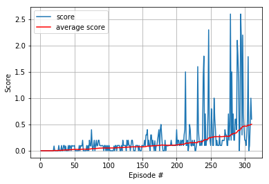

# Report

In this project we train two agents to play tennis. If an agent hits the ball over the net, it receives a reward of +0.1. 
If an agent lets a ball hit the ground or hits the ball out of bounds, it receives a reward of -0.01. 
Thus, the goal of each agent is to keep the ball in play.

Each agent observes a state with length 24, which includes the position and velocity of the ball and racket. 
Each agent receives its own, local observation. Two continuous actions are available, corresponding to movement toward (or away from) the net, and jumping.

The task is episodic, and in order to solve the environment, the agents must get an average score of +0.5 (over 100 consecutive episodes, after taking the maximum over both agents).

### The algorithm

The learning algorithm used in the project is the deep deterministic policy gradient (DDPG) algorithm ([Lillicrap et al. 2016](https://arxiv.org/pdf/1509.02971.pdf)).
The algorithm combines the actor-critic approach with insights from the success of Deep Q Network (DQN) ([Mnih et al. 2015](https://storage.googleapis.com/deepmind-media/dqn/DQNNaturePaper.pdf)). 
DQN cannot be straightforwardly applied to continuous domains since it relies on a finding the action that maximizes the
action-value function, which in the continuous valued case requires an iterative optimization process at every step.
The application of DQN by simply discretizing the action space has many limitations.
The DDPG algorithm is based on the deterministic policy gradient (DPG) algorithm ([Silver et al. 2014](http://proceedings.mlr.press/v32/silver14.pdf)).
The DPG algorithm maintains a parameterized actor function which specifies the current policy by deterministically mapping states to a specific action. 
The critic is learned using the Bellman equation as in Q-learning.

### Implementation

In our implementation the neural network of the actor has 3 fully connected layers respectively with input/output dimensions of 24/400, 400/300, 300/2.
The neural network of the critic has 3 fully connected layers respectively with input/output dimensions of 24/400, 400/300, 300/1. 
Both networks uses two batch normalization layers and ReLUs as activation functions. It seemed that batch normalization helped to learn faster.

Unlike the [previous project](https://github.com/efonda/Continuous-Control-Udacity-Reinforcement-Learning/), without noise the agent would not learn well. 
Even with the Ornstein-Uhlenbeck noise we could not get it to work by trying a few parameters, perhaps a more extensive search would solve the problem. 
We added instead Gaussian noise and it worked.
Moreover it helped updating the policy and value parameters using a batch of experience tuples multiple times per step.

The final hyperparameter choice is the following:   

BUFFER_SIZE = int(1e6) # replay buffer size.  
BATCH_SIZE = 256       # minibatch size.  
GAMMA = 0.99           # discount factor.  
TAU = 2e-3             # for soft update of target parameters.  
LR_ACTOR = 1e-3        # learning rate of the actor.  
LR_CRITIC = 1e-3       # learning rate of the critic.  
WEIGHT_DECAY = 0       # L2 weight decay   

### Result

   
The plot of the scores shows the learning of the algorithm.  

The agent solved the environment in 310	episodes, with an average score over the last 100 episodes of 0.504. 
The training took about 2 hours and 20 minutes using a GPU.

## Future work
We tested a few combinations of hyperparameters, but to improve the score and decrease the number of episodes to solve the environment
we could perform an exhaustive hyperparameters search and optimization.

An effective way to improve the performance of DDPG would be to try Prioritized Experience Replay.

The next step would be to try the multi-agents deep deterministic policy gradient (MADDPG) algorithm  ([Lowe et al. 2016](https://arxiv.org/pdf/1706.02275.pdf)),
which is an extension of the algorithm used in this project but for multiple agents.
